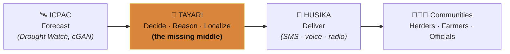
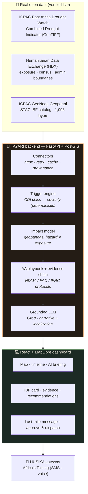
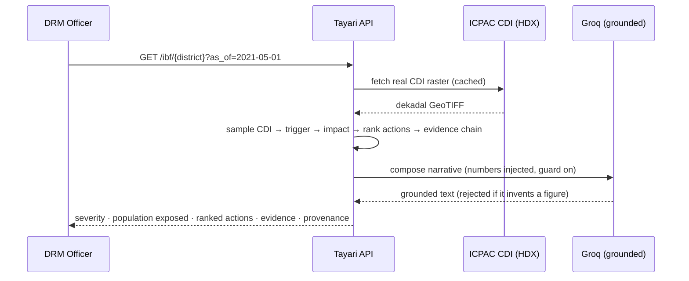

<div align="center">

# 🌍 Tayari

### The Anticipatory Action Co-pilot — turning early *warning* into early *action*

*From ICPAC's forecast → to a life-saving decision → to the last mile.*

`FastAPI` · `PostGIS` · `geopandas` · `React` · `MapLibre` · `Groq (Llama-3.3)` · `Docker`
**100% real open data · 29 automated tests · one-command deploy**

### 🎥 Watch the demo (3 min)

[](https://youtu.be/wGpn9EZxptI)

▶️ **https://youtu.be/wGpn9EZxptI**

</div>

---

## ⚡ The 30-second story

> Between **2020 and 2023, the Horn of Africa suffered its worst drought in four decades.**
> More than **20 million people** faced crisis-level hunger. Millions of livestock — the entire
> savings and livelihood of pastoralist families — perished.
>
> Here is the uncomfortable part: **the forecasts were right.** ICPAC saw it coming months ahead.
> The warnings existed. And still, the response arrived too late.

Why? Because **seeing a drought and acting on it are two different problems.**

- ICPAC already produces world-class forecasts.
- HUSIKA already delivers alerts to the last mile.
- But the step *in between* — deciding **who exactly is at risk, what action to trigger, and why** —
  is still done by hand, district by district, in spreadsheets and PDFs. **It doesn't scale.**

ICPAC calls this the *"long-pending operationalization of Impact-Based Forecasting."*
It is the **last-mile gap** — and it is where lives and livelihoods are lost.

**Tayari is the missing middle.** It plugs into ICPAC's real data and, for every district, answers
the three questions that turn a forecast into action — with an auditable trail — then writes the
message that reaches the herder, in their language, on their basic phone.

> **Tayari doesn't compete with ICPAC's tools. It completes the stack.**

---

## 🧭 Table of contents
- [Where Tayari fits](#-where-tayari-fits)
- [Architecture](#-architecture)
- [How the reasoning works](#-how-the-reasoning-works)
- [Features](#-features)
- [Real data sources](#-real-data-sources-all-verified-live)
- [Responsible AI](#-responsible-ai-the-grounding-contract)
- [Tech stack](#-tech-stack)
- [Run it locally](#-run-it-locally)
- [API reference](#-api-reference)
- [Testing](#-testing)
- [Project structure](#-project-structure)
- [Roadmap](#-roadmap)
- [Attribution](#-attribution--license)

---

## 🗺️ Where Tayari fits



The forecast exists. The delivery pipe exists. **Tayari is the decision-and-reasoning layer that
was missing between them.**

---

## 🏛️ Architecture



**Request flow for a single district:**



---

## 🔬 How the reasoning works

Tayari runs a **five-stage pipeline** on real data:

| # | Stage | What it does | How |
|---|-------|--------------|-----|
| 1 | **Ingest** | Pull the real drought signal, exposure, and boundaries | HDX CKAN, STAC, GeoNode — cached + provenance-tagged |
| 2 | **Trigger** | Detect when a district crosses the anticipatory-action threshold | Deterministic CDI-class → severity mapping (**no LLM**) |
| 3 | **Impact** | Estimate *who* is affected, by livelihood | `geopandas` hazard × real census exposure |
| 4 | **Reason** | Rank anticipatory actions + build an auditable evidence chain | Playbook (NDMA/FAO/IFRC) + `forecast → threshold → exposure → action` |
| 5 | **Localize** | Write the last-mile message for each audience | Grounded Groq LLM → SMS + voice, EN + Swahili |

**Worked example (real May-2021 dekad, Garissa County):**
`CDI class 8 (Alert)` → trigger fired → `841,353 people exposed (78% pastoralist)` →
top action *"Emergency water trucking, lead time 7 days"* → Swahili SMS generated → handed to HUSIKA.
Region-wide that dekad: **4 counties triggered, ~1.88 million people exposed.**

---

## ✨ Features

- 🗺️ **Real-time drought map** with a draggable **dekad timeline** — scrub any real 10-day period back to the 2021 drought.
- 🤖 **Self-writing AI situation briefing** — a live, grounded regional summary that types itself in.
- 📊 **Impact-Based Forecast per district** — severity, population exposed, livelihood breakdown, all source-cited.
- 🧾 **Auditable evidence chain** on every recommendation — no black box.
- 🎯 **Ranked anticipatory actions** with lead time, cost band, and responsible actor.
- 🗣️ **One forecast → three audiences** (pastoralist · farmer · DRM officer) in **English + Swahili**, as **low-literacy SMS + voice/IVR** for digital inclusion.
- 🧑‍⚖️ **Human-in-the-loop** — the officer approves before anything is dispatched.
- 🔌 **HUSIKA-compatible dispatch** via Africa's Talking (sandbox; live-server ready).

---

## 📡 Real data sources (all verified live)

| Source | API | Used for |
|--------|-----|----------|
| **ICPAC East Africa Drought Watch — CDI** | HDX CKAN (`data.humdata.org/api/3`) | Drought hazard signal (dekadal GeoTIFFs) |
| **Humanitarian Data Exchange (HDX)** | CKAN | Exposure, admin boundaries, impact history |
| **ICPAC GeoNode Geoportal** | `geoportal.icpac.net/api/v2` | 1,096 geospatial layers + WMS/WFS |
| **ICPAC STAC IBF catalog** | STAC 1.1.0 | Impact-based-forecasting catalog (drought + flood) |
| **Kenya KNBS 2019 Census** | official statistics | Population & livelihood exposure |
| **Kenya NDMA / FAO / IFRC** | published protocols | Anticipatory-action playbook |

> **No mock data is served anywhere.** If an upstream is unreachable, Tayari serves timestamped
> cache and flags it `stale` — it never fabricates a value.

---

## 🔒 Responsible AI: the grounding contract

The LLM writes prose and localized messages — but it is **structurally prevented from inventing
numbers**:

1. Every figure (population, CDI class, lead times) is **computed by the deterministic engine** and injected as context.
2. A **numeric-hallucination guard** scans the LLM output and **rejects any number not present in the computed facts** (strict on population/impact figures).
3. On any violation or timeout, it **falls back to a deterministic grounded template.**

Result: the system runs even with **zero LLM credentials**, and the AI can never overstate a casualty
or exposure figure. A human still approves every dispatch.

---

## 🧰 Tech stack

**Backend:** Python 3.11 · FastAPI · Pydantic v2 · PostgreSQL + PostGIS · SQLAlchemy/GeoAlchemy2 ·
geopandas · shapely · rasterio · httpx · tenacity
**Reasoning:** deterministic trigger engine + YAML playbook · Groq (Llama-3.3) with grounding guard
**Frontend:** React 18 · TypeScript · Vite · MapLibre GL · TailwindCSS · TanStack Query
**Delivery:** Africa's Talking (SMS + voice)
**Ops:** Docker Compose · pytest (unit + live-endpoint integration)

---

## 🚀 Run it locally

```bash
git clone https://github.com/sovanmondal/tayari.git
cd tayari
cp .env.example .env          # public data sources need no keys; LLM/SMS optional
docker compose up --build
```

| Service | URL |
|---------|-----|
| 💻 Dashboard | http://localhost:5173 |
| ⚙️ API + docs | http://localhost:8000/docs |
| ❤️ Live upstream health | http://localhost:8000/health |

**Optional — enable the real LLM briefing:** set in `.env`
```
LLM_PROVIDER=groq
GROQ_API_KEY=your_groq_key
GROQ_MODEL=llama-3.3-70b-versatile
```
Without it, Tayari uses the deterministic grounded templates — still fully functional.

---

## 🔌 API reference

| Method | Endpoint | Description |
|--------|----------|-------------|
| `GET` | `/health` | Live status of HDX / STAC / GeoNode |
| `GET` | `/dekads` | All available real CDI dekads |
| `GET` | `/districts?as_of=YYYY-MM-DD` | All districts with severity for the map |
| `GET` | `/ibf/{id}` | Impact-Based Forecast + narrative + provenance |
| `GET` | `/recommendations/{id}` | Ranked anticipatory actions + evidence chain |
| `GET` | `/briefing` | AI-authored regional situation briefing |
| `POST` | `/messages` | Generate an audience/language-specific message |
| `POST` | `/dispatch` | Hand the message to the HUSIKA gateway |

---

## ✅ Testing

```bash
cd backend && pytest            # 29 tests
pytest -m live                  # live-endpoint integration (hits real ICPAC/HDX/GeoNode)
```
Covers the deterministic trigger engine, impact model, playbook + evidence, the grounding guard,
localization, API routes, and live connectors.

---

## 📂 Project structure

```
tayari/
├── backend/            FastAPI service
│   └── app/
│       ├── connectors/ HDX · STAC · GeoNode clients (cache + provenance)
│       ├── domain/     trigger engine · impact model · playbook · evidence (pure, tested)
│       ├── services/   hazard · ibf_service · briefing · narrative · localization · sms · llm
│       ├── data/       thresholds.yaml · playbook_drought.yaml · exposure_ke.py
│       └── api/routes/  health · ibf · messages
├── frontend/           React + Vite + MapLibre dashboard
├── docs/               requirements · design · submission materials
├── presentation/       animated intro / technical-outro / cover (HTML)
└── docker-compose.yml
```

---

## 🔭 Roadmap

- Live HUSIKA server integration for real dispatch.
- Extend the same pipeline to **floods and disease** (the STAC catalog already carries flood IBF).
- Probabilistic / ensemble triggers from ICPAC's **cGAN** forecasts.
- More languages (Somali, Amharic, Oromo, Borana).

---

## 🙏 Attribution & license

Built on open data and open-source methodology from **ICPAC / IGAD** (East Africa Drought Watch,
Hazards Watch, STAC IBF catalog, `ibf-thresholds-triggers`), the **Humanitarian Data Exchange (HDX)**,
the **Copernicus EDO** CDI methodology, and the **GeoNode** project. Population from **KNBS 2019 Census**.
Anticipatory-action framing from **Kenya NDMA (EDE)**, **FAO**, and **IFRC** protocols.

Built for the **IGAD Hackathon 2026** — *Smarter Early Warning, Stronger Communities.*

<div align="center">

**From forecast, to decision, to action — for every community that's been left waiting.**

</div>
